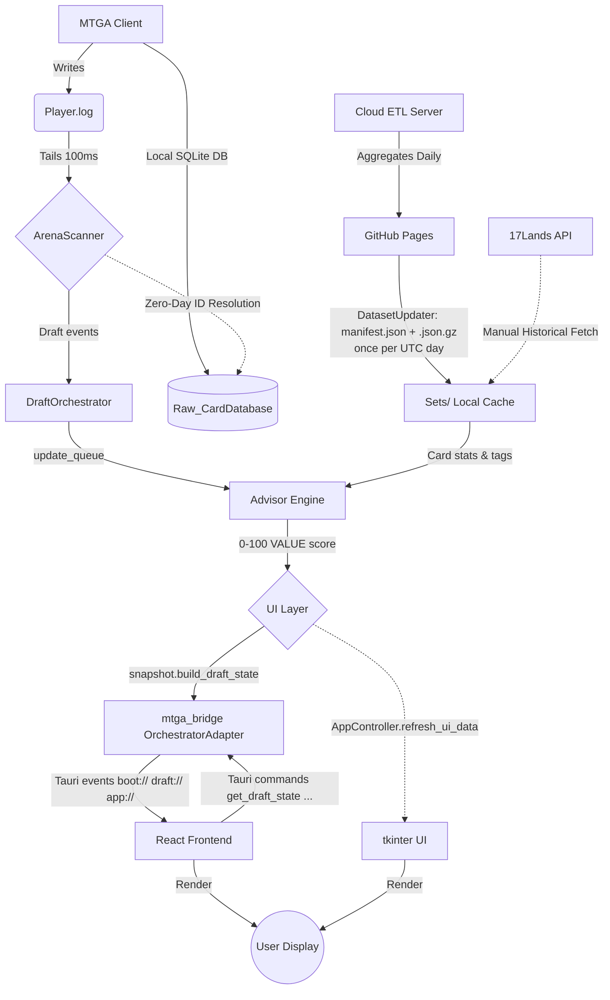

# System Overview & Architecture

**Status:** Active | **Version series:** desktop v0.x (`desktop/`) · legacy tkinter v4.x (`src/constants.py`) | **Target:** Architecture Specification

## 1. Introduction

The MTGA Draft Tool is a reactive desktop overlay for Magic: The Gathering Arena (MTGA). It functions as a sidecar process that monitors local game logs to infer draft state and provides real-time statistical advice based on data from 17Lands.com, augmented by deep local MTGA SQLite database queries.

The app ships **two UIs that share one Python engine**:

| UI | Tech | Platforms | Distribution |
|---|---|---|---|
| **Desktop app** (default) | Tauri 2 + PyO3 (pytauri); React + TypeScript frontend | macOS (arm64) · Windows (x86_64) | `.dmg` / `.app` · `.msi` / `.exe` |
| **Legacy tkinter** | ttkbootstrap themed tkinter | Windows · macOS · Linux | PyInstaller, on demand |

Both UIs read the same `config.json`, the same downloaded datasets, and the same `src/` engine. The desktop app is the default entry point; `main.py` dispatches to it when a build is present and falls back to tkinter otherwise (see [Boot Sequence](#6-boot-sequence--ui-dispatch)).

## 2. Core Architecture

The system follows a uni-directional data flow, heavily utilizing background threading to ensure the UI remains responsive (Zero-Idle Fast Path).

- **Legacy path:** the tkinter UI polls a background `DraftOrchestrator` thread and refreshes itself via `AppController.refresh_ui_data`.
- **Desktop path:** a Python bridge package (`mtga_bridge`) owns the same scanner/orchestrator, but instead of rendering widgets it serializes state into pydantic **viewmodels** and streams them to a React frontend over typed Tauri events. The frontend calls back into Python through Tauri commands.

## 3. Key Modules

| Module | Function | Criticality |
| :--- | :--- | :--- |
| **ArenaScanner** (`src/log_scanner.py`) | Tails `Player.log` on a background thread, executes normalized fuzzy matching, manages the state machine (Idle -> Drafting -> Sealed -> Game), persists draft state to `Temp/` for crash recovery. | **High** (app fails without it) |
| **DraftOrchestrator** (`src/ui/orchestrator.py`) | Background thread that drains scanner events into an `update_queue`, triggers dataset load for the event, and pokes the UI on state changes. | **High** |
| **Advisor Engine** (`src/advisor/engine.py`) | The "Compositional Brain" (v5.5). Normalizes win-rates, calculates Z-Scores, applies Lane Commitment, tracks VOR, and measures pip-density. | **High** |
| **DatasetUpdater** (`src/dataset_updater.py`) | Downloads pre-compiled `.json.gz` datasets + `manifest.json` from GitHub Pages. Auto-sync runs at most once per UTC day (see §5). | **High** |
| **Dataset** (`src/dataset.py`) | Loads and merges 17Lands stats with the local card DB, resolves archetypes, normalizes WUBRG color keys. | **High** |
| **FileExtractor** (`src/file_extractor.py`) | Queries the local MTGA SQLite database to resolve `GrpId` -> card name/CMC/types/colors; discovers the log and data folder across platforms. | **High** |
| **ScryfallTagger** (`src/scryfall_tagger.py`) | Harvests Scryfall community tags (`otags`) for semantic role classification. | Medium |
| **17Lands client** (`src/seventeenlands.py`) | Direct `card_ratings` fallback client with caching/rate limiting (used when no cloud dataset exists). | Medium |
| **mtga_bridge** (`desktop/src-tauri/src-python/mtga_bridge/`) | The desktop bridge: `paths.py` (env pinning), `snapshot.py` (headless `AppController` port), `orchestrator_adapter.py` (queue -> Tauri events), `viewmodels.py` (IPC models), `commands.py` (command surface), `services.py` / `datasets.py` (pure implementations), `dataset_notifier.py` / `app_update_notifier.py` (post-boot background threads), `version.py` (the desktop app's own version literal). | **High** (desktop) |
| **React frontend** (`desktop/src/`) | Vite + React + TypeScript tabbed UI: Draft dashboard, Taken, Custom Deck, Suggest, Sealed, Compare, Tiers, Datasets, Settings. | Medium |
| **AppController** (`src/ui/app.py`) | Legacy tkinter application controller. | Legacy |

## 4. Operational Lifecycle

### Phase A: Boot

1. Parse CLI args (`-f/--file`, `-d/--data`, `--ui`, `--version`), load `config.json`.
2. Dispatch to the chosen UI (see §6).
3. Launch splash (tkinter) / BootScreen (desktop) with a background task that:
   - Locates `Player.log` (manual flag -> system default -> config fallback).
   - Locates the MTGA SQLite database directory.
   - Syncs cloud datasets via `DatasetUpdater` (if auto-sync is enabled and not already synced today).
   - Initializes `ArenaScanner` with the log file and set list.
   - Deep-scans the log for an active draft and recovers state from `Temp/`.

### Phase B: The Draft Loop (Active)

The application polls for file changes via a background thread every **100ms** to ensure zero UI freezing.

1. **State: Waiting for Event**
   - Listens for: `[UnityCrossThreadLogger]==> Event_Join` or `"CardPool":[`
   - Action: Identify Set Code (e.g., "OTJ"). Load stats for the event set. Map the local SQLite database for zero-day card names.

2. **State: Pack Review**
   - Listens for: `Draft.Notify` containing `PackCards` array.
   - Action:
     1. Retrieve stats for `CardsInPack`.
     2. Retrieve stats for `TakenCards` (User's pool).
     3. Pass data to the **Advisor Engine**.
     4. Render UI tables sorted by contextual "Score".

3. **State: Pick Confirmation**
   - Listens for: `Event_PlayerDraftMakePick`.
   - Action: Move selected `GrpId`(s) from the "Pack" array to "TakenCards". Update "Signals" logic.

4. **State: Draft Complete**
   - A terminal `DeckSelect` (`DraftStatus: "Completed"`) retires the live pack/pick and transitions to the recap view.

### Phase C: Shutdown

- Save window geometry, column preferences, and settings to `config.json` via thread-safe atomic writes.

## 5. Dataset Auto-Sync (Once per UTC Day)

Dataset downloads are throttled to **at most once per natural UTC day** (UTC 00:00 boundary). `CardData.last_auto_sync_date` persists the UTC date; `DatasetUpdater.is_auto_synced_today()` gates every automatic trigger (bootstrap, the desktop notifier, and the tkinter post-boot check). Manual downloads (`FileExtractor` / 17Lands) and the post-upgrade migration bypass the gate. The date is stamped on *attempt* so a failed day is not retried.

## 6. Boot Sequence & UI Dispatch

`main.py` resolves the UI target in this order:

1. An explicit `--ui desktop` / `--ui tkinter` CLI flag wins.
2. Otherwise the `default_ui` setting in `config.json` decides (default `desktop`).
3. When the target is `desktop`, a built binary is located via the `MTGA_DRAFT_DESKTOP` env var, the bundled `.app` on macOS, or a cargo build under `desktop/target/{release,debug}`. If found, it is launched detached.
4. If no build exists: an explicit `--ui desktop` prints build guidance and exits with code 2; the auto/config path warns and **falls back to tkinter** so a source checkout always launches.

`--version` short-circuits before dispatch and prints the tkinter `APPLICATION_VERSION` (used as the CI smoke test).

After launch, the desktop bridge runs two background daemon threads: the
dataset notifier (~1.5s, §5) reports what the boot-time sync downloaded, and
the app-update notifier (~3s, `04-external-integrations.md` §5.B) checks the
latest GitHub release tag against the desktop's own version. Both emit Tauri
events (`datasets://updated`, `update://available`) that the frontend surfaces
as bottom-right toasts.

## 7. Constraints & Invariants

1. **Rate Limiting:** 17Lands and Scryfall API requests must be cached aggressively. Network requests use exponential backoff to handle HTTP 429/403 responses gracefully.
2. **Color Normalization:** All color strings must be sorted WUBRG (`GW` -> `WG`). The keys in 17Lands JSONs vary; the app normalizes them upon dataset ingestion so dictionary lookups never fail.
3. **Thread Safety:** The UI must never block. Intensive parsing and Monte Carlo work runs on background threads and communicates through queues (`update_queue` in Python, Tauri events in the desktop app).
4. **Serialization Boundary:** Every desktop IPC model derives from `_VM` (`mtga_bridge/viewmodels.py`), whose `alias_generator=to_camel` maps `pack_cards` -> `packCards`, and which serializes with `by_alias=True`. Python code that consumes `model_dump()` must pass `by_alias=False`.
5. **Dataset Integrity:** The server ETL guarantees all 26 archetypes exist per card and injects an `"All Decks"` fallback, so changing the deck filter never throws `KeyError`.
