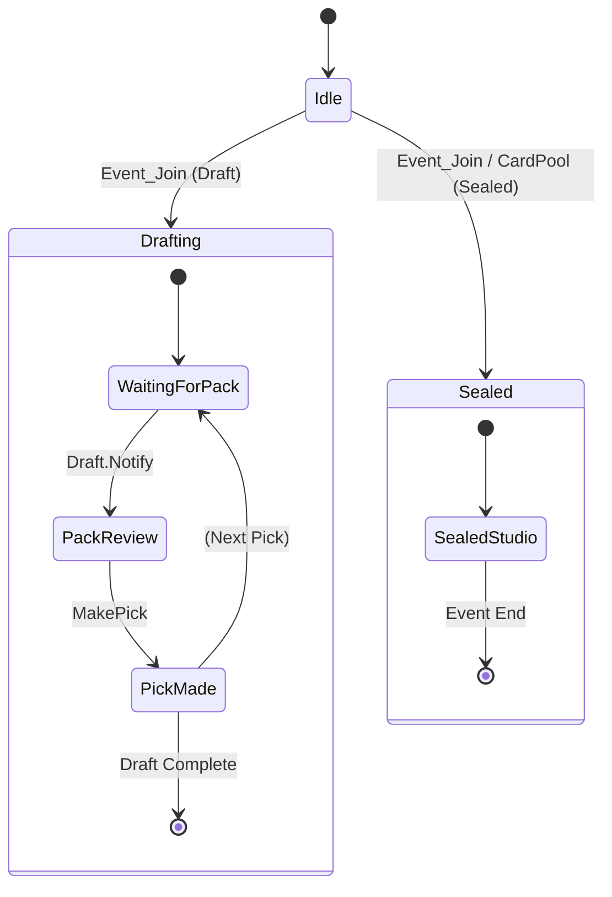

# Log Parsing Specification

**Status:** Critical Path | **Context:** Migration Logic & State Tracking

## 1. The Source: Player.log

The application monitors the Unity engine log generated by MTG Arena.

- **Encoding:** UTF-8
- **Format:** Unstructured text, but specific lines contain injected JSON payloads prefaced by `[UnityCrossThreadLogger]`.
- **Behavior:** The file grows indefinitely while the game is open. The parser maintains a cursor (byte offset) to only process new lines and utilizes a "Zero-Idle" check to prevent parsing overhead if the file size hasn't changed.

## 2. Robust Matching Algorithm

The application does **not** use strict string equality for detection. It uses a "Normalized Fuzzy Match" to survive minor Arena updates.

**The Algorithm (`src/utils.py` -> `detect_string`):**

1. Read line from log.
2. Fast Path: Does it contain `{`? If no, skip.
3. Fast Path: Exact Substring check.
4. Slow Path: Normalize (Uppercase, remove spaces/underscores). Check: `if TARGET_KEYWORD in NORMALIZED_LINE`.
5. Extract JSON payload.

---

## 3. Event Catalog (Premier & Traditional Draft)

These are the signals for Human drafts (Premier/Traditional/Cube).

### A. Draft Start

- **Trigger String:** `Event_Join` (Normalized: `EVENTJOIN`)
- **JSON Payload:**
  ```json
  {
    "request": "{\"EventName\": \"PremierDraft_OTJ_20240416\", ...}"
  }
  ```

### B. Pack Data (The "Draft Packet")

- **Trigger String:** `Draft.Notify` (Normalized: `DRAFT.NOTIFY`)
- **JSON Payload:**
  ```json
  {
    "draftId": "uuid...",
    "SelfPack": 1,
    "SelfPick": 2,
    "PackCards": "12345,67890,11121,..." // Comma-separated string of Integers
  }
  ```

### C. Pick Confirmation

- **Trigger String:** `Event_PlayerDraftMakePick` (Normalized: `EVENTPLAYERDRAFTMAKEPICK`)
- **JSON Payload:**
  ```json
  {
    "request": "{\"GrpId\": 12345, \"GrpIds\": [12345, 67890], ...}"
  }
  ```
  > **Pick-Two Drafts:** Certain events (like OM1 or TMT) allow picking 2 cards per pack. The payload handles this by returning a JSON array under `GrpIds` rather than a singular `GrpId`. The `cards_per_pick` logic dynamically tracks this to correctly compute the "Wheel Tracker" offsets.

---

## 4. Event Catalog (Quick Draft / Bot Draft)

Bot drafts use a completely different internal module name (`BotDraft`).

### A. Draft Start

- **Trigger String:** `BotDraft_DraftStatus` (Normalized: `BOTDRAFTDRAFTSTATUS`)

### B. Pack Data

- **Trigger String:** `DraftPack` (Found inside `BotDraft_DraftStatus` payload)
- **JSON Payload:**
  ```json
  {
    "DraftStatus": "PickNext",
    "DraftPack": ["12345", "67890"],
    "PackNumber": 0, // 0-indexed! (0 = Pack 1)
    "PickNumber": 0 // 0-indexed! (0 = Pick 1)
  }
  ```
- **Logic:** Crucial step is converting the 0-indexed Pack/Pick to 1-indexed for the internal UI state.

---

## 5. Event Catalog (Sealed)

Sealed events dump the entire pool at once and skip pack-by-pack drafting.

### A. Pool Generation

- **Trigger String:** `"CardPool":[`
- **JSON Payload:**
  ```json
  {
    "Course": {
      "InternalEventName": "Sealed_DSK_20240924",
      "CardPool": [123, 124, 125, ...]
    }
  }
  ```
- **Logic:**
  1. The app deeply scans for `Event_Join` or `InternalEventName` containing `"CardPool"`.
  2. If the user closes the app mid-draft, it safely reconstructs the Sealed state upon restart by sniffing this payload.
  3. Transitions UI directly into the **Sealed Studio** workspace.

---

## 6. State Machine Diagram


