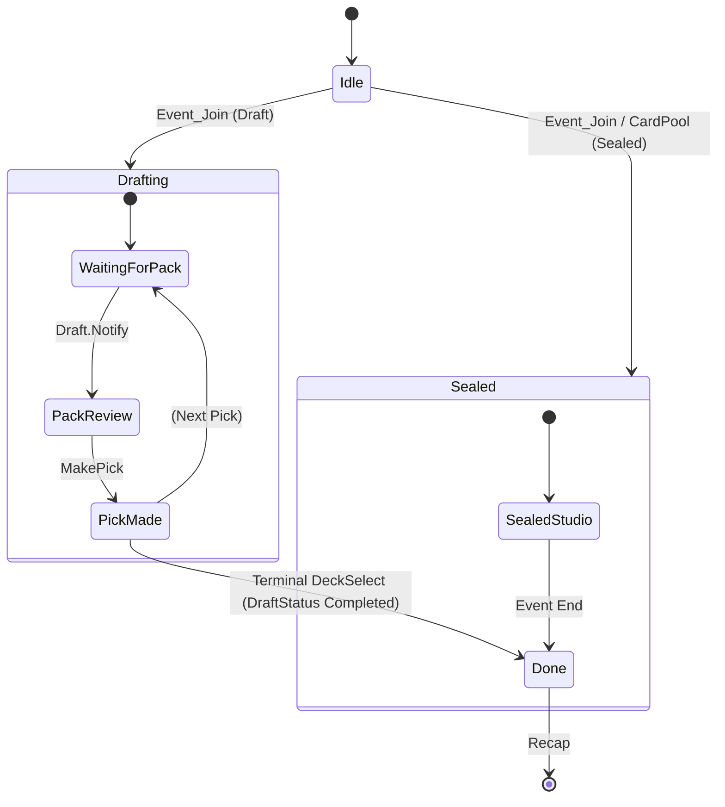

# Log Parsing Specification

**Status:** Critical Path | **Context:** Migration Logic & State Tracking

## 1. The Source: Player.log

The application monitors the Unity engine log generated by MTG Arena.

- **Encoding:** UTF-8
- **Format:** Unstructured text, but specific lines contain injected JSON payloads prefaced by `[UnityCrossThreadLogger]`.
- **Behavior:** The file grows indefinitely while the game is open. The parser maintains a cursor (byte offset) to only process new lines and utilizes a "Zero-Idle" check to prevent parsing overhead if the file size hasn't changed.

## 2. Robust Matching Algorithm

The application does **not** use strict string equality for detection. It uses a "Normalized Fuzzy Match" to survive minor Arena updates.

**The Algorithm (`src/utils.py` -> `detect_string`):**

1. Read line from log.
2. Fast Path: Does it contain `{`? If no, skip.
3. Fast Path: Exact Substring check.
4. Slow Path: Normalize (Uppercase, remove spaces/underscores). Check: `if TARGET_KEYWORD in NORMALIZED_LINE`.
5. Extract JSON payload.

---

## 3. Event Catalog (Premier & Traditional Draft)

These are the signals for Human drafts (Premier/Traditional/Cube).

### A. Draft Start

- **Trigger String:** `Event_Join` (Normalized: `EVENTJOIN`)
- **JSON Payload:**
  ```json
  {
    "request": "{\"EventName\": \"PremierDraft_OTJ_20240416\", ...}"
  }
  ```

### B. Pack Data (The "Draft Packet")

- **Trigger String:** `Draft.Notify` (Normalized: `DRAFT.NOTIFY`)
- **JSON Payload:**
  ```json
  {
    "draftId": "uuid...",
    "SelfPack": 1,
    "SelfPick": 2,
    "PackCards": "12345,67890,11121,..." // Comma-separated string of Integers
  }
  ```

### C. Pick Confirmation

- **Trigger String:** `Event_PlayerDraftMakePick` (Normalized: `EVENTPLAYERDRAFTMAKEPICK`)
- **JSON Payload:**
  ```json
  {
    "request": "{\"GrpId\": 12345, \"GrpIds\": [12345, 67890], ...}"
  }
  ```
  > **Pick-Two Drafts:** Certain events (like OM1 or TMT) allow picking 2 cards per pack. The payload handles this by returning a JSON array under `GrpIds` rather than a singular `GrpId`. The `cards_per_pick` logic dynamically tracks this to correctly compute the "Wheel Tracker" offsets.

### D. Draft Completion (Terminal DeckSelect)

The draft is considered finished when the log reports a `DeckSelect` module with a completed `DraftStatus`:

- **Trigger:** A `DraftStatus` payload whose `CurrentModule` is `"DeckSelect"` (DraftStatus `"Completed"`).
- **Action:** The scanner *retires* the live pack/pick and the UI transitions to the post-draft recap view instead of rendering an empty pack.

---

## 4. Event Catalog (Quick Draft / Bot Draft)

Bot drafts use a completely different internal module name (`BotDraft`).

### A. Draft Start

- **Trigger String:** `BotDraft_DraftStatus` (Normalized: `BOTDRAFTDRAFTSTATUS`)

### B. Pack Data

- **Trigger String:** `DraftPack` (Found inside `BotDraft_DraftStatus` payload)
- **JSON Payload:**
  ```json
  {
    "DraftStatus": "PickNext",
    "DraftPack": ["12345", "67890"],
    "PackNumber": 0, // 0-indexed! (0 = Pack 1)
    "PickNumber": 0 // 0-indexed! (0 = Pick 1)
  }
  ```
- **Logic:** Crucial step is converting the 0-indexed Pack/Pick to 1-indexed for the internal UI state.

---

## 5. Event Catalog (Sealed)

Sealed events dump the entire pool at once and skip pack-by-pack drafting.

### A. Pool Generation

- **Trigger String:** `"CardPool":[`
- **JSON Payload:**
  ```json
  {
    "Course": {
      "InternalEventName": "Sealed_DSK_20240924",
      "CardPool": [123, 124, 125, ...]
    }
  }
  ```
- **Logic:**
  1. The app deeply scans for `Event_Join` or `InternalEventName` containing `"CardPool"`.
  2. If the user closes the app mid-draft, it safely reconstructs the Sealed state upon restart by sniffing this payload.
  3. Transitions UI directly into the **Sealed Studio** workspace.

---

## 6. Crash Recovery & the Desktop Deep Scan

Draft state is persisted to `Temp/active_draft_state.json` as it changes, so a
restart mid-draft resumes exactly where the user left off.

On boot, the desktop app performs a **deep scan** of `Player.log` from the
beginning before tailing:

- The scanner replays `Event_Join` / `BotDraft_DraftStatus` / `"CardPool":[`
  payloads to reconstruct the active event.
- The desktop bridge's `snapshot.build_draft_state` (`mtga_bridge/snapshot.py`)
  serializes the reconstructed state for the React dashboard, so recovery is
  byte-identical to the live scan.
- If the log file severely desyncs, the UI's **Rescan** action wipes the in-memory
  state and re-runs the deep scan.

---

## 7. State Machine Diagram


```mermaid
stateDiagram-v2
    [*] --> Idle

    Idle --> Drafting: Event_Join (Draft)
    Idle --> Sealed: Event_Join / CardPool (Sealed)

    state Drafting {
        [*] --> WaitingForPack
        WaitingForPack --> PackReview: Draft.Notify
        PackReview --> PickMade: MakePick
        PickMade --> WaitingForPack: (Next Pick)
        PickMade --> Done: Terminal DeckSelect (DraftStatus Completed)
    }

    state Sealed {
        [*] --> SealedStudio
        SealedStudio --> Done: Event End
    }

    Done --> [*]: Recap
```

### Code mapping (architecture-review issue 11)

Every state and transition above has an explicit counterpart in
`src/scanner_state.py`, consumed by `ArenaScanner`:

| Diagram state | Code symbol |
|---|---|
| `Idle` | `ScannerPhase.IDLE` |
| `Drafting.WaitingForPack` | `ScannerPhase.DRAFTING_WAITING_FOR_PACK` |
| `Drafting.PackReview` | `ScannerPhase.DRAFTING_PACK_REVIEW` |
| `Drafting.PickMade` | `ScannerPhase.DRAFTING_PICK_MADE` |
| `Sealed.SealedStudio` | `ScannerPhase.SEALED_STUDIO` |
| `Done` | `ScannerPhase.DONE` (`derive_scanner_phase` with UNKNOWN + recap payload) |

- Transitions are single-point `TRANSITIONS[(ScannerPhase, ScannerEvent)]` rows;
  `ArenaScanner.__perform_search_logic` / `_apply_transition` consult the table
  and `logger.warning` on unregistered (illegal) combinations.
- `derive_scanner_phase` is the one place scanner fields map onto a phase
  (the fields remain the source of truth; the phase is a view driven by the
  dispatch, exposed as `ArenaScanner.phase`).
- Event handlers: `_search_pack_notify` / `_search_pack_bot` / `_search_pick_human`
  / `_search_pick_v1` / `_search_pick_bot` / `_search_card_pool`. The terminal
  `DECK_SELECT_COMPLETED` transition dispatches to `_search_pack_bot`, which calls
  `_mark_draft_complete` as its completion helper.
- `ScannerEvent.EVENT_JOIN` rows document the `Idle/Done → Drafting` edge; the
  transition itself is applied inside `draft_start_search` / `__check_event`.

**Known diagram/code gaps (deliberate — no behavior is added to paper over
them):**

- **`SealedStudio → Done: Event End` has no scanner counterpart.** Sealed has
  no terminal event handler (`_mark_draft_complete` only fires from the bot
  family's terminal DeckSelect); completion is derived by consumers via
  `is_draft_complete` (`src/snapshot_actions`).
- **There is no `Game` state.** It appears in no diagram edge, no event type,
  and no scan family; the scanner never tracks match play.
- **Human drafts have no scanner-side terminal detection.** The `PickMade →
  Done` transition is exercised by the bot family; human completion is derived
  by consumers via `is_draft_complete`.
